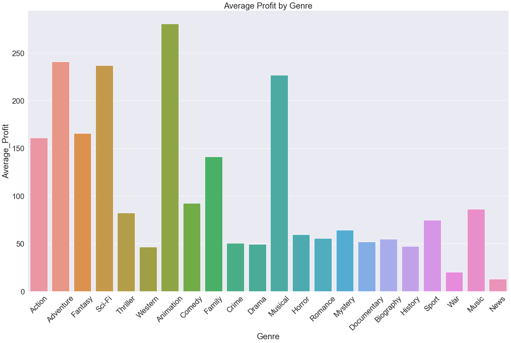
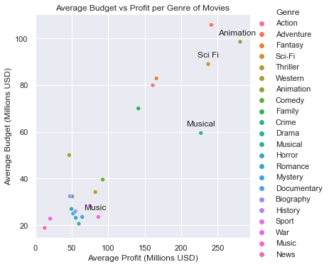
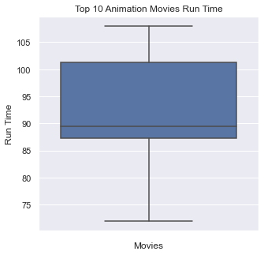

## Overview

> The most important thing for an emerging movie company is to know what movies made money. To this end, we decided to research which genre of movies Computing Vision should invest in by looking at profitability and return on investment (ROI). We also explored which budget brackets would deliver the best return, and which runtime would be optimal. 

## Instructions for Navigating Repository

> Our repository is organized on each others personal workbooks represented in the main repository, which we used to sandbox all our ideas into before putting our final code and collaborative code in the "main" and the Primary Notebook in the main is our final deliverable.  In our repository we also included an ERD for our reference.

## Business Understanding

> Profit at the end of the day is the goal for all companies and therefore when starting a movie company, it is important to know which movie products make money. Therefore, our objective is to find the optimal movie type and structure that will optimize profits. To achieve this, we must examine the key metrics of a movie, namely genre, runtime, and budget.

## Data Understanding and Analysis
> We drew our data from our available datasets, with our group using im.db.zip and tn.movie\_budgets.csv wherein we merged these data sets into a single Pandas data frame where we all then draw our analysis from. This data frame served as the foundation for the rest of our analysis.

## Packages Used
- sqlite3 - Working with SQL Lite
- numpy - Working with Arrays
- pandas - Data Manipulation
- matplotlib.pyplot - Mathematic Calculations
- SciPy Stats - Hypothesis Testing
- seaborn - Data Visualization

### Description of data

'im.db' is a SQL database containing 8 tables with movie information

- we used the variables: primary\_title, runtime\_minutes, genres, avraerating, and numvotes (coming from 2 of the tables)

'tn.movie\_budgets'

- contains the columns: release\_date, movie, production\_bufget, domestic\_gross, and worldwide\_gross

- We produced the following columns from the dataset:

- production\_budget\_in\_millions, domestic\_gross\_in\_millions, worldwide\_gross\_in\_millions, ROI\_domestic,

- ROI\_international,and profit\_in\_millions

### Three visualizations (the same visualizations presented in the slides and notebook)

 From this data we were able to determine that Animation was the most profitable Genre, which is where we turned our focus to

We also confirmed that based on the Budgets put in by animation studios, the average profit also weighed in

> Focusing in on the top ten most profitable animation movies, we wanted to measure runtime (in minutes) as a goal to figure out what time length to pinpoint for the most optimal movie for our studio. We found a range of movies between 87 minutes and 101 minutes was the 25th and 75th percentile of the IQR Scale of our boxplot, as well as the average runtime for the top 10 most profitable movies was 91 minutes, a little over an hour and a half.

### Statistical Communication
A 1-sample t-test was done on the sample of animated movies using profit 

* Null Hypothesis: The Animation profits are the same as the rest of the population 

* Alternative Hypothesis: The Animation profits are higher than the rest of the population 

* Chosen alpha = 0.05 

* p-value = 0.0000000007345 

p-value < alpha: reject the null hypothesis 

## Conclusion
   ### Summary of conclusions including three relevant findings

   ### 1) High Investment = High Profit

Our analysis showed that according to the data, films with higher budgets receive higher returns while lower budgets yield smaller returns

   ### 2) Optimal Genre = Animation

Out of all the genres examined, animation yielded the highest profit

   ### 3) Optimal Film Run-Time Range = 87 Minutes to 101 Minutes

Examining the 10 most successful animated films by profit and ratings yielded this range as the most common 

## Presentation - Group 1

"[Presentation Group 1]" "(y)"

